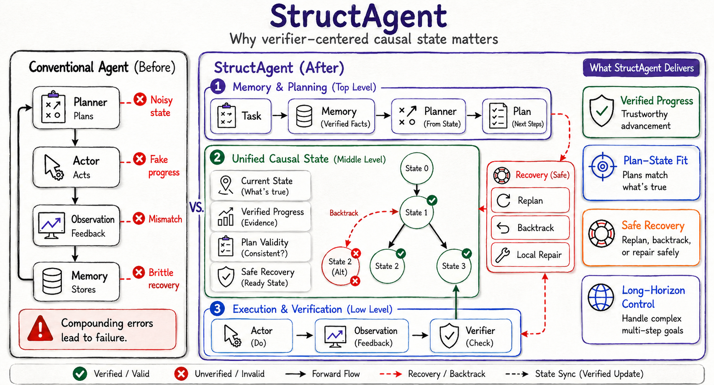
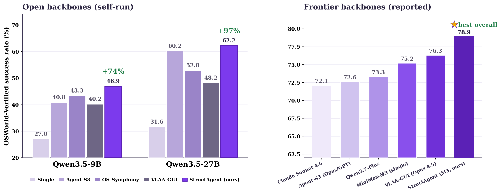
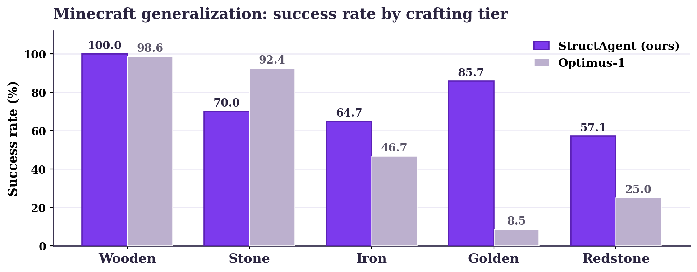

<h1 align="center">StructAgent</h1>

<p align="center">
  <b>A verifier-centered planner–actor–verifier agent for long-horizon computer use.</b><br>
  <i>Progress is committed only when a verifier can attach evidence to a state update — not when the model says it's done.</i>
</p>

<p align="center">
  <a href="LICENSE"></a>
  <a href="https://arxiv.org/abs/XXXX.XXXXX"></a>
  
  
  
</p>

<p align="center">
  
</p>

---

## Overview

Long-horizon computer use is brittle because agents lose track of **which task
requirements currently hold**. Screenshots show the interface, and long action
histories show what happened — but neither shows the *causal status* of the task.
**StructAgent** makes a unified, evidence-backed **task State** the shared interface
between a **planner**, an **actor**, and a **verifier**:

- The **planner** reads a compact State (typed milestones + bound facts + evidence) and chooses the next subgoal — it cannot mark anything complete.
- The **actor** executes a short burst of GUI / shell / app / Office actions toward that subgoal.
- The **verifier** checks evidence (deterministic file/shell/a11y/URL probes when available, visual judgment otherwise) and emits **events** — the **only** thing that advances State.
- A **DONE auditor** gates completion, and **failure attribution** routes recovery to the planner, actor, verifier, or environment.

With the open **MiniMax-M3** backbone, StructAgent reaches a **new open-model state of
the art on OSWorld**; the same design transfers to **Mind2Web** web tasks. See the
[paper](https://arxiv.org/abs/XXXX.XXXXX) for full results, ablations, and analysis.

## Results snapshot

<p align="center">
  
</p>

On **OSWorld-Verified**, StructAgent raises open Qwen3.5 backbones by **+74% (9B)**
and **+97% (27B)** in relative success rate over the single-model agent, and beats
every open-source agent framework at matched settings. With the **MiniMax-M3**
backbone it reaches **78.9%** — the best overall, above frontier single models and
their agent frameworks. It also generalizes to open-world **Minecraft** ([below](#minecraft))
and to **Mind2Web** web tasks. See the [paper](https://arxiv.org/abs/XXXX.XXXXX)
for full per-domain tables and ablations.

Demo video: coming soon.

## Why it's different

| Raw signal | StructAgent structure |
|---|---|
| Long action history | Task **State** with milestone status + evidence traces |
| Planner self-report of progress | **Verifier event** required before any State update |
| Visual guess of completion | Deterministic **probe** (file / shell / a11y / URL) with visual fallback |
| Free-form retry | **Failure attribution** → routed recovery |
| Past experience | Retrieved **memory**, filtered by current State |

---

## Installation

```bash
git clone https://github.com/your-org/StructAgent.git
cd StructAgent

conda create -n structagent python=3.10 -y
conda activate structagent
pip install -r requirements.txt
playwright install chromium      # for Mind2Web

cp .env.example .env             # then fill in keys for the models you use
```

## Model setup

> **Models & scope.** This release implements StructAgent for **Qwen3.5-9B / 27B**
> (the models we serve locally). The paper's state-of-the-art uses **MiniMax-M3**;
> because its grounding and tool-calling differ from Qwen's, the MiniMax-M3
> integration is **coming soon**.

StructAgent talks to any OpenAI-compatible endpoint. Pick **one** of:

**A. Local open models via vLLM** (recommended for OSWorld; reproduces the paper):
```bash
# planner / actor / grounding / DONE-auditor  (Qwen3.5-9B on :8010)
bash scripts/serve_qwen35_9b.sh
# Mind2Web judge  (Qwen3.5-27B on :8012, tensor-parallel 2)
bash scripts/serve_qwen35_27b.sh
# ...or both at once with Docker:
docker compose -f scripts/docker-compose.vllm.yml up -d
```

**B. Hosted models via OpenRouter** (no GPU needed — mainly for the Mind2Web judge
or to experiment with a hosted planner/verifier):
```bash
echo "OPENROUTER_API_KEY=sk-..." >> .env
# then pass e.g.  --verifier_model claude-sonnet  (or gemini, gpt-4o, ...)
```

Model aliases and their endpoints live in [`mm_agents/model_endpoints.py`](mm_agents/model_endpoints.py);
override any endpoint with `VLLM_<KEY>_URL`. See [`docs/MODELS.md`](docs/MODELS.md).

## Quickstart

**1. Set up the environment** — OSWorld needs a desktop VM (Docker / VMware / AWS) and
Mind2Web needs a Chrome instance. See [`docs/ENVIRONMENT.md`](docs/ENVIRONMENT.md).

All runs go through **`scripts/run.sh`**, whose defaults are the **full agent
from the paper** (perception, failure attribution, stuck diagnosis, DONE auditor,
feasibility — all on). Configure it with environment variables; see
[`docs/CONFIG.md`](docs/CONFIG.md).

**2. Run OSWorld** (default split `test_nogdrive.json` — 360 tasks, no Google account needed):
```bash
MODEL=vllm_qwen35-vl NUM_ENVS=8 bash scripts/run.sh
```

**3. Run Mind2Web** (graded by the answer-blind Online-Mind2Web judge):
```bash
MODEL=vllm_qwen35-vl VERIFIER_MODEL=vllm_qwen35-27b MAX_STEPS=50 \
  TEST_ALL_META_PATH=evaluation_examples/test_mind2web.json bash scripts/run.sh
```

> The experience-memory layers are **off by default**; download the prebuilt banks
> (`python scripts/download_memory.py`) and run with `MEMORY=on` to enable them.
> See [`docs/CONFIG.md`](docs/CONFIG.md).

**4. Inspect results:**
```bash
python show_result.py                     # aggregate success rates
# open results/.../<task>/trajectory.html # per-step screenshots + verifier events
```

A full reproduction walkthrough is in [`docs/REPRODUCE.md`](docs/REPRODUCE.md).

---

## How it works

The agent lives in [`mm_agents/structagent/`](mm_agents/structagent/). One `predict()`
call runs the planner → actor-burst → verifier → recovery loop:

```
structagent/
├── loop.py            # StructAgent class — the predict() loop
├── core/
│   ├── planner/       # choose the next subgoal from State
│   ├── actor/         # decompose → ground → compile → execute a burst
│   ├── verifier/      # boundary-verify milestones; emit evidence events
│   ├── recovery/      # stuck detection + replan routing
│   └── final_audit/   # DONE auditor (evidence-gated completion)
├── ledger/            # the unified task State (milestones, facts, timeline)
├── perception/        # screen → structured snapshot (sheets / slides / docs)
├── attribution/       # failure diagnosis → routed recovery
├── memory/            # experience retrieval (filtered by State)
├── actions/           # typed tools: shell, files, browser, Calc/Impress/Writer
└── domain/            # per-app knowledge + evidence guides
```

```python
from mm_agents.structagent import StructAgent

agent = StructAgent(model="vllm_qwen35-vl", verifier_model="vllm_qwen35-27b")
actions = agent.predict(instruction, obs)   # obs = {"screenshot": ..., "accessibility_tree": ...}
```

## Minecraft

The paper also studies StructAgent's design in an open-world **Minecraft** setting:
the same verifier-derived State and role-separated execution carry over, with
inventory-delta probes standing in for accessibility/file probes. This is a
**separate, independent implementation**, maintained in its own repository:

**→ [github.com/AayushSalvi/StructAgent-Minecraft](https://github.com/AayushSalvi/StructAgent-Minecraft)**

<p align="center">
  
</p>

Across five crafting tiers, StructAgent is competitive with Optimus-1 and pulls
clearly ahead on the harder **Iron / Golden / Redstone** tiers.

## Repository layout

```
StructAgent/
├── mm_agents/structagent/   # the agent (above)
├── desktop_env/             # OSWorld environment (from xlang-ai/OSWorld)
├── evaluation_examples/     # OSWorld + Mind2Web task configs
├── scripts/                 # runner, vLLM serving, Mind2Web re-scoring
├── lib_run_single.py        # per-task loop (OSWorld + Mind2Web)
├── mind2web_eval.py         # Mind2Web grading bridge + judge client factory
├── web_judge_online_m2w.py  # answer-blind Online-Mind2Web grader
└── docs/                    # ENVIRONMENT / MODELS / REPRODUCE
```

## Citation

```bibtex
@article{wu2026structagent,
  title   = {StructAgent: Towards a Controllable Causal System for Long-horizon Computer-Use Agents},
  author  = {Wu, Wenyi and Zhu, Sibo and Zhou, Kun and Salvi, Aayush and Song, Zixuan and Huang, Biwei},
  journal = {arXiv preprint arXiv:XXXX.XXXXX},
  year    = {2026}
}
```

## Acknowledgements

Built on top of **[OSWorld](https://github.com/xlang-ai/OSWorld)** (the desktop
environment and task suite). Web generalization uses **[Mind2Web](https://osu-nlp-group.github.io/Mind2Web/)**
and the answer-blind **Online-Mind2Web** grading protocol (arXiv:2504.01382). Local
serving uses **[vLLM](https://github.com/vllm-project/vllm)** with the Qwen3.5 and
MiniMax-M3 model families. See [`NOTICE`](NOTICE).

## License

Apache-2.0 — see [`LICENSE`](LICENSE).
